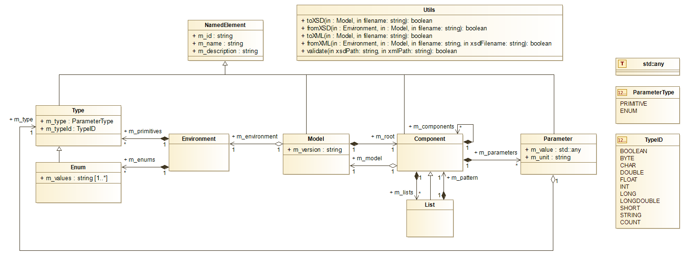

# Model Documentation

**Contents**<br>
[General Idea](#general-idea)<br>
[UML Diagram](#uml-diagram)<br>
[Environment Class](#environment-class)<br>
[Model Class](#model-class)<br>
[List Class](#list-class)<br>
[Full Example](#full-example)<br>
[Python Module](#python-module)

## General Idea

The general idea is to allow the user to instantiate Environment and Model classes only. Regarding other classes, such as Component, Parameter or List all the instantiation work is encapsulated in the Model class. Same goes for the Type and Enum classes inside of the Environment class.

```
auto env = new Environment();
auto mm = new Model();

// ...

auto c = new Component(...); // NOT CORRECT
auto c =  mm->addComponent(...); // CORRECT

// ...

delete mm;
delete env;
```

You can not access the constructor of the other classes (protected scope), everything is done internally so that you will not have to worry about memory management, **except regarding the Environment and Model classes : this is up to the developer to manage their creation and destruction.**

*Every Component/List/Parameter you will create have some common properties you can (**and you actually should**) set : ID (mandatory), name (optional) and description (optional). These properties will be displayed in the web HMI to help the people filling a configuration.*

## UML Diagram



## Environment Class

The Environment class stores all the type-related datas.

It stores the primitives types (such as ```INT```, ```LONG```, ```STRING```...) and their informations which will be displayed on the web HMI.

It also stores the enumeration types. You can then add an enumeration to the environment and add its values list to it.

**Example :**
```
auto myEnum = environment->addEnumType("enumID", "enumName", "enumDescription");
myEnum->addValue("Easy");
myEnum->addValue("Normal");
myEnum->addValue("Hard");
```

The ```TypeID``` enumeration is defined in ```Type.h``` and defines all of the primitive types :
```
enum TypeID
{
    BOOLEAN = 0,
    BYTE,
    CHAR,
    DOUBLE,
    FLOAT,
    INT,
    LONG,
    LONGDOUBLE,
    SHORT,
    STRING,

    COUNT
};
```

Regarding the used types, they are defined in the `Environment.h` file as follows :
```
typedef bool          Boolean;
typedef unsigned char Byte;
typedef char          Char;
typedef double        Double;
typedef float         Float;
typedef int           Int;
typedef long          Long;
typedef long double   LongDouble;
typedef short         Short;
typedef std::string   String;
```

## Model Class

The `Model` class is linked to an `Environment` which will provide the Model with all the data types it might need.

**Example :**
```
Environment * env = new Environment();
[...]
Model * model = new Model("version", "id", "name", "description");
model->setEnvironment(env);
```

A Model stores a root component in which you will be able to add Lists, Components and/or Parameters.

**Example :**
```
auto l = model->addList("id", "name", "description", "descriptionPattern");
auto c = model->addComponent("id", "name", "description");
auto p = model->addParameter(TYPE, "id", "name", "description", "unit");
```

***When adding a parameter to an element, you should provide its type. The type can be either a primitive type or an enumeration type.***

**Example :**
```
auto p1 = metaModel->addParameter(FLOAT, "p1", "P1", "...");

metaModel->getEnvironment()->addEnumType("enumID", "enumName", "enumDescription");
auto p2 = metaModel->addParameter("enumID", "p2", "P2", "...");
```

## List Class

The `List` class defines a list of elements (items) which all follow the same pattern (i.e. all of its items have the same set of Lists/Components/Parameters). They have the same properties but are of course independent between each others.

For that purpose, a `Component` is internally created when you create a List : its *pattern*. That's why when you create a list you also have to specify a pattern description : it will be used as a common description for all of the List's items when rendered in the web HMI.

**Example :**
```
auto l = metaModel->addList("id", "name", "description", "descriptionPattern");
```

You can, at anytime, get the pattern component to change its attributes :
```
auto pattern = l->getPattern();
```

It is expected that the developer specifies the list's pattern content within the core, then the web HMI will allow the user to "*Add an element to the list*" which basically consists in cloning this pattern and its elements recursively.

Eventually, one can get an item from a list using the `const std::shared_ptr<Component> getItem(const std::string& id) const` method.

## Full Example

Here is a full example showing how to create an Environment and a Model (holding a Component) linked to this environment.

It then save these structures and datas in configuration files.

Eventually, we load the configuration file inside a new Environment and a new Model, we compare them to be sure that they hold the same informations, then we make sure to **clean all of the manually allocated memory**.

***Note :*** *the `Utils::fromXML()` procedure already ensures internally that the `.xml` file is valid against the `.xsd` file. If, for some reason, you want to check by yourself is a `.xml` file is valid against a `.xsd` file, take a look at the `Utils::validate()` method.*

```
auto env = new Environment();
auto mm = new Model("5.1.2", "mm", "Model 5.1.2", "Describes OpenSAND 5.1.2 Model.");
mm->setEnvironment(env);

auto c = mm->addComponent("c", "Component", "My custom component.");
c->addParameter(INT, "p", "P", "My parameter.", "kbps")->setValue(5);

// Writing Model structure (MetaModel) to model.xsd and Model data (DataModel) to model.xml

if(Utils::toXSD(mm, "model.xsd")) {
    if(Utils::toXML(mm, "model.xml")) {
        std::cout << "MM and DM saved successfully." << std::endl;
    } else {
        std::cerr << "Error while saving DM." << std::endl;
        return EXIT_FAILURE;
    }
} else {
    std::cerr << "Error while saving DM." << std::endl;
    return EXIT_FAILURE;
}

Environment * envLoaded = nullptr;
Model * mmLoaded = nullptr;

// Reading Model structure (MetaModel) from model.xsd and Model data (DataModel) from model.xml

if(Utils::fromXSD(&envLoaded, &mmLoaded, "model.xsd")) {
    if(Utils::fromXML(&envLoaded, &mmLoaded, "model.xml", "model.xsd")) {
        std::cout << "MM and DM loaded successfully." << std::endl;
    } else {
        std::cerr << "Error while loading DM." << std::endl;
        return EXIT_FAILURE;
    }
} else {
    std::cerr << "Error while loading DM." << std::endl;
    return EXIT_FAILURE;
}

assert( env->isSame(envLoaded) );
assert( mm->isSame(mmLoaded) );

delete mmLoaded;
delete envLoaded;

delete mm;
delete env;
```

## Python Module

This C++ library comes with a Python module (made using Boost.Python). Its source code is located in `./Sources/Module/` and consists in a single file.

The Python module consists in a shared library called `ConfigurationPy.so`, to import it, simply use :
```
import ConfigurationPy

// your code goes here...
```
As a full example, you can take a look at the unit tests written in Python (which are basically the same as those written in C++) located in `./Tests/Python/tests.py`.
