# Configuring the OpenSAND Configuration Backend

The OpenSAND configuration manager will need to access the machines onto which
you want to run the OpenSAND process through SSH. But to keep things simple,
the frontend will only let you specify the IP address of the machine you are
trying to reach (you can optionally use the user@ip:port syntax, though) so
every special configuration that you need on your network (such as using private
keys or the like) should be specified in the /var/opensand/.ssh/config file on
the machine you installed the opensand-deploy packet.

# Using the OpenSAND Configuration Frontend  (Web interface)

The configuration frontend is available on the port 80 in the machine where you installed
the web interface. So just fire a browser to the IP of your install machine to access it.

## Managing projects

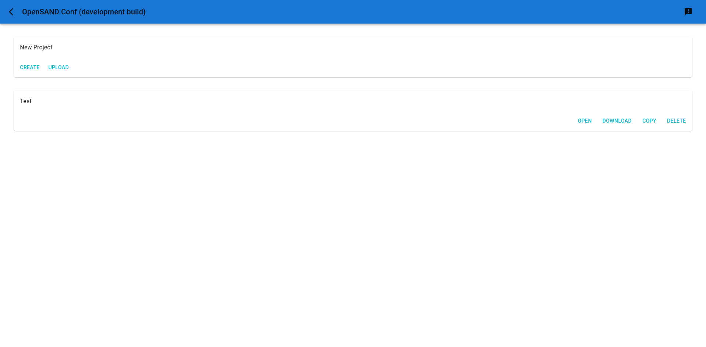

On the main interface, you can create a new project by clicking on the "Create" button
and specifying a name that doesn't already exist. You can also share projects with
other people through a tarball and import them in your own platform through the "Upload"
button.

Projects that you created can also be copied to a new project by clicking their "Copy"
button; or deleted by clicking their "Delete" button.

By clicking the "Download" button on a project you can retrieve a tarball that you can
share with others, or that you can use to deploy configuration files on you platform.

Lastly the "Open" button, or even the whole project card, let you access the project's
main configuration page.

## Adding a new entity to a platform

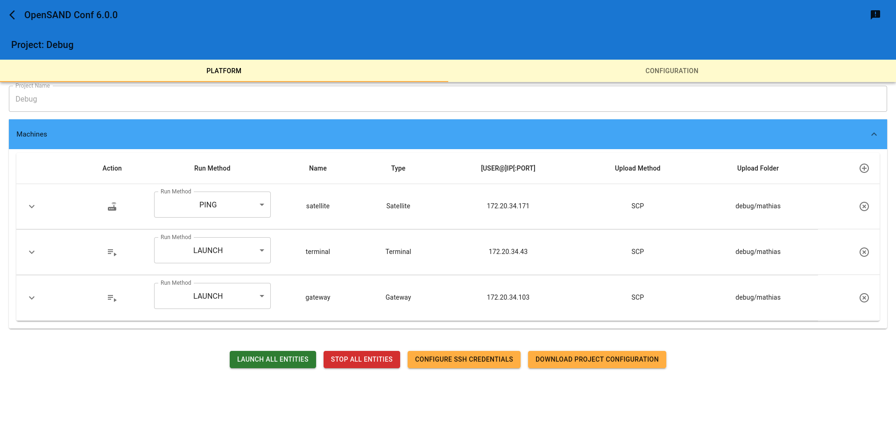

On the main project page, you have two tabs. The first one is to manage the machines of
your platform and specify informations to access them. You will be able to perform
actions on them through the list. Actions requiring a password or an SSH passphrase
will prompt for them and never store it.

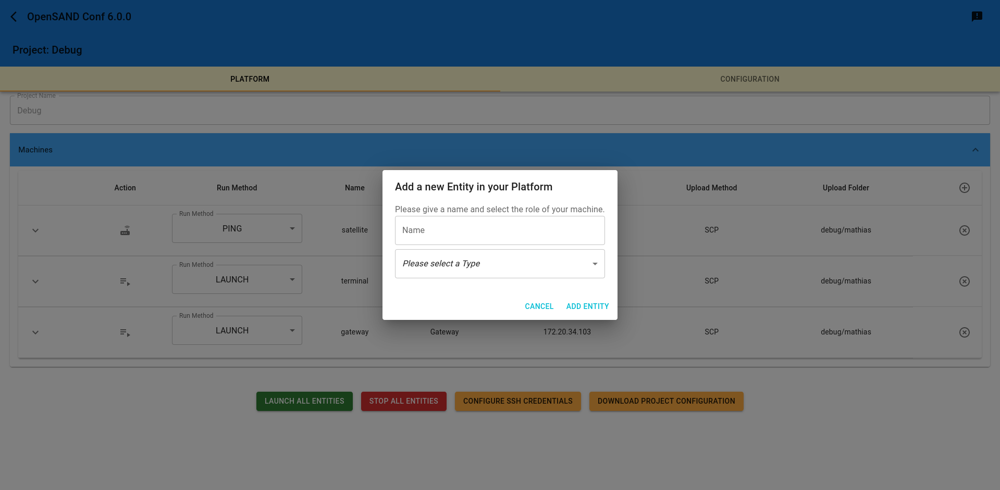

On this "Platform" tab, you can add a new machine that you want to control. You must give
it a unique name and specify the kind of OpenSAND entity that you want to run on it. This
does not need to be a unique machine for each entity, but you must tell each entity apart
if you want to manage several OpenSAND processes on a single machine.

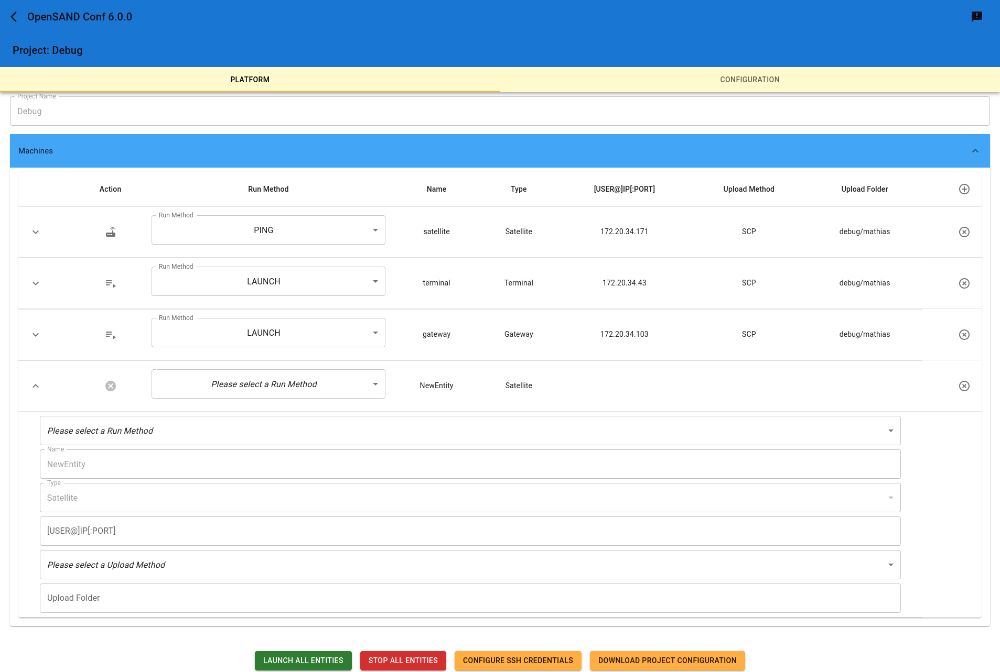

Once you’ve added a new entity, you can specify its IP address, where and how to push
configuration files onto it, and what kind of management action you want to perform.

## Configuring an entity

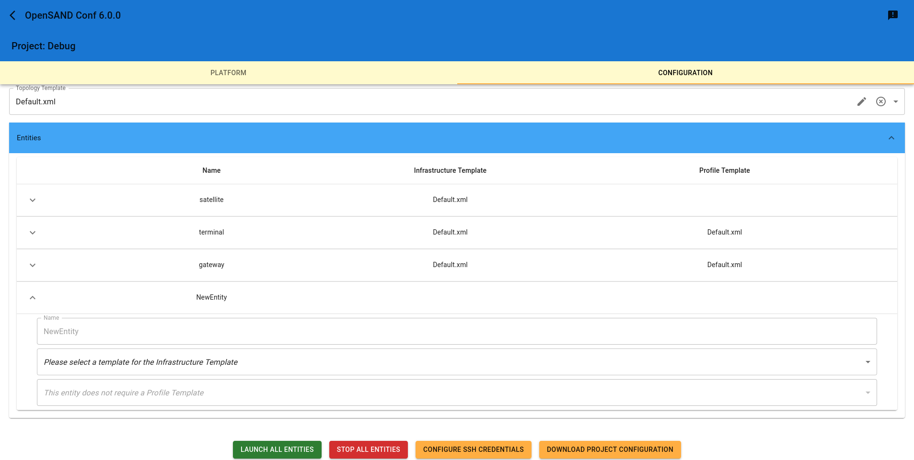

Once entities are added on the "Platform" tab, they also appear on the "Configuration" tab.
In there, you will be able to edit the configuration files for each of your entities.

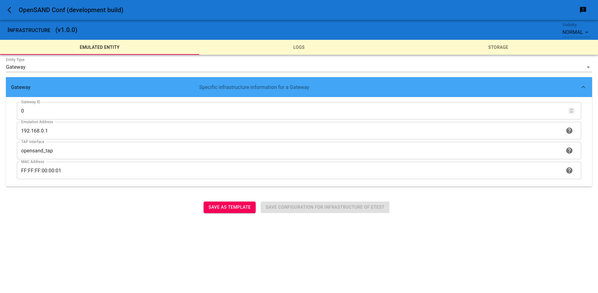

You also have the ability to save a configuration file as a template for others entities
to not start a new one each time. For instance, you can provide specific log levels in an
infrastructure configuration file, save it as a template and others entities will be
able to reuse the same level configured when you select the template that you just created.

## Deployment and Emulation

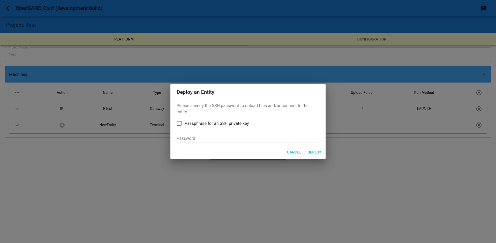

Once an entity is fully configured, you can start the OpenSAND binary on the machine by
choosing the LAUNCH "Run Method" in the "Platform" tab. Don't forget to specify in which
folder the configuration files must be pushed into. If the OpenSAND binary starts
successfully, a progression circle will replace the launch button: as long as the process
is running on the machine, the circle will spin. If the process stops, the launch button
is displayed back.

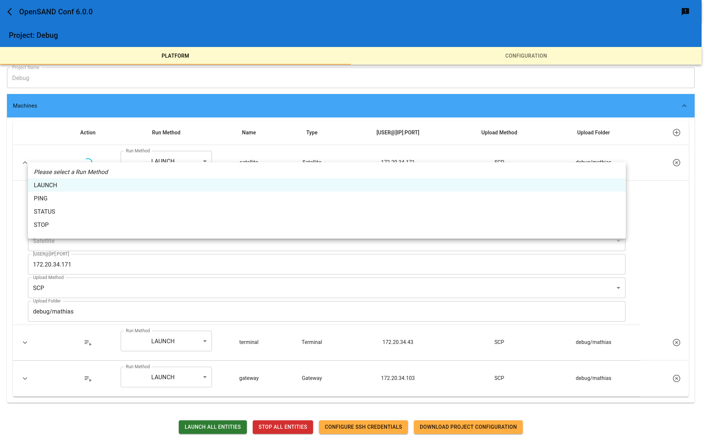

You can manually stop the OpenSAND binary by selecting the STOP "Run Method". Success
can be monitored by switching back to the LAUNCH method and checking wether the launch
button or the progress circle is displayed.

Please note that SSH credentials will only be asked once, for the first process you launched
in an attempt to make it more straightforward for the majority of the configurations that
have the same credentials on all the machines running OpenSAND binaries. If you somewhat
need to change SSH credentials between each machines, you can use the "Configure SSH
Credentials" button to save new ones that will be applied to the next LAUNCH or STOP
operation.

Lastly, as changing the "Run Method" to LAUNCH or STOP on each entity may be tedious, the
"Launch All Entities" and "Stop All Entities" buttons are provided as a shortcut.

## Testing

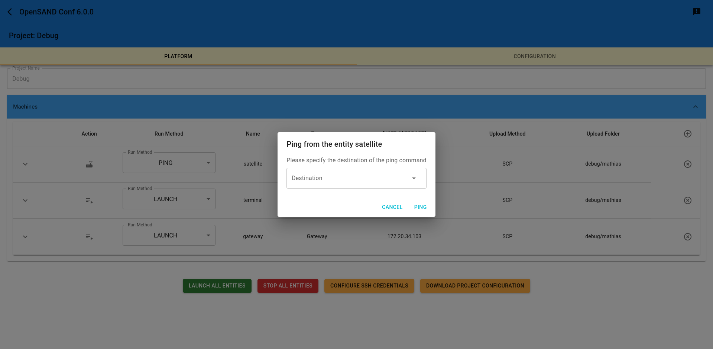

You can test emulated links by using the PING "Run Method". Upon starting a ping, you
must provide a destination address to ping. The interface will assist you by displaying
a list of your emulation addresses, so you can choose one to ping from the entity you're
starting your ping with; or use an other address of your liking.

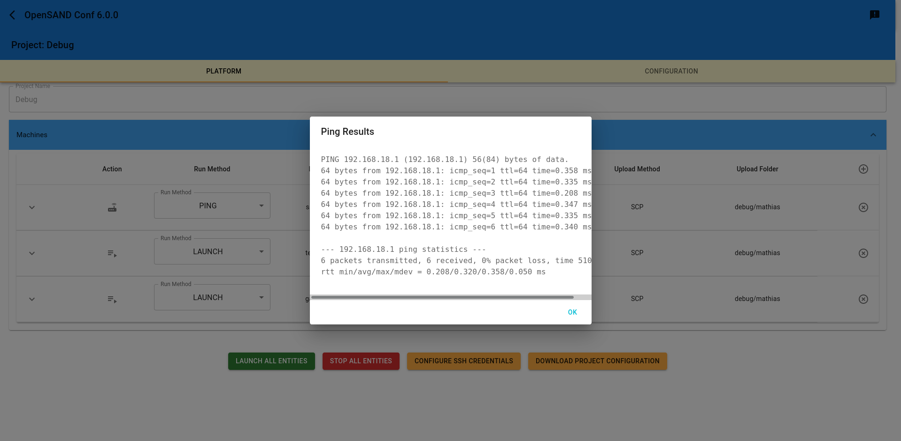

The result of the ping will be displayed shortly after in a new dialog window.

# Configuration examples

## Basics

First you’ll need to define your satellite network topology by creating spots, and
adding carriers to them. Edit the desired "Topology Template" which is common to
all entities.

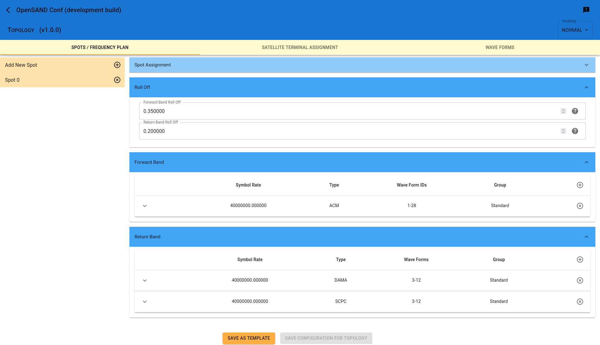

Then, for each entity, you’ll need to configure their "Infrastructure Template" to
provide information about the network they need to use.

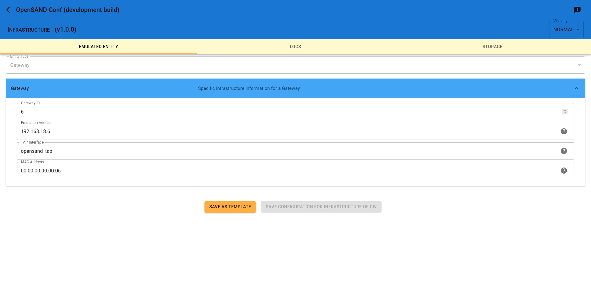

Lastly, you need to tweak you entities behaviour by assigning them a "Profile Template"
to configure themselves from. You’ll be most likely interested in the "Access" or
"Physical Layer" tab.

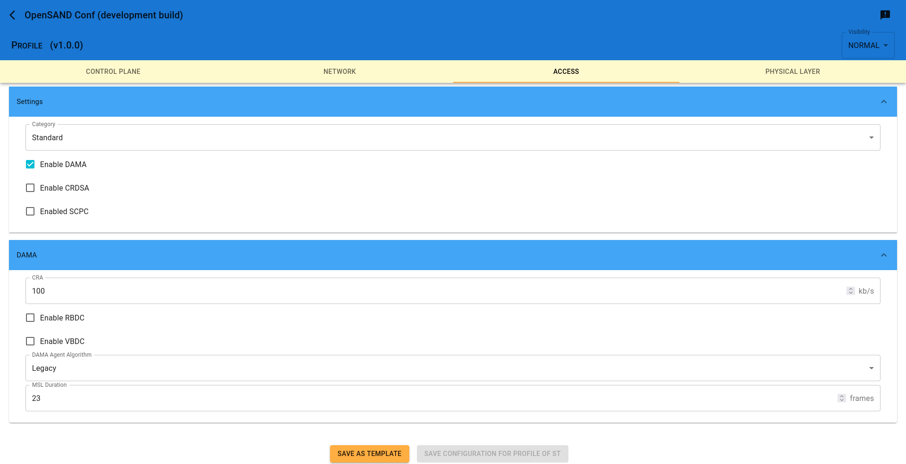

Note that a satellite does not need a profile configuration, unless you happen to use
the regenerative mode or ISL (see below), in which case it is mandatory.

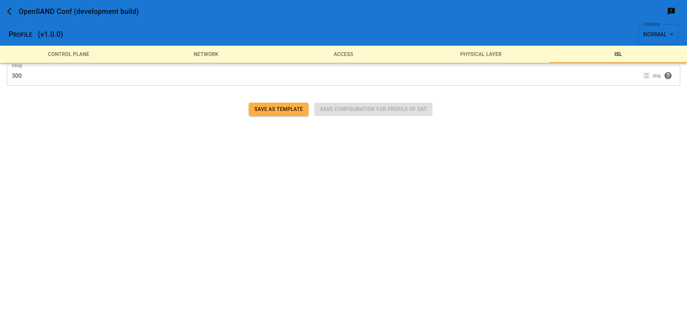

## Regenerative satellite

By default, a spot in your topology will use a transparent satellite on both the forward
and the return link. You can change this behaviour in the topology file by selecting the
desired (if any) regeneration level for your packets in the satellite.

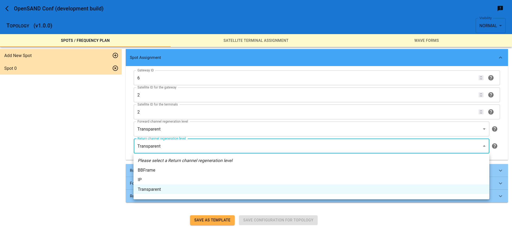

> Note that although it is possible to select different regeneration level for the forward
and the return link, doing so result in a memory access error crashing the satellite. This
will be fixed in a future version.

When selecting a regeneration level of IP for any or both links, you **must** configure a
LanAdaptation block in your satellite. Refer to the next section for details.

## ISL

When selecting a different satellite for the GW and STs of a given spot, or when routing
packets between spots assigned to two different satellites, some packets need to travel
through ISL.

In order to properly configure an ISL, an entry must be added in the infrastructure file
of both satellites. You **must** create an Interconnect block for any kind of ISL communication
to work properly. In addition, if your ISL is done with IP packets (regeneration IP selected
on one or both links in your satellites), you need to configure a LanAdaptation block too.

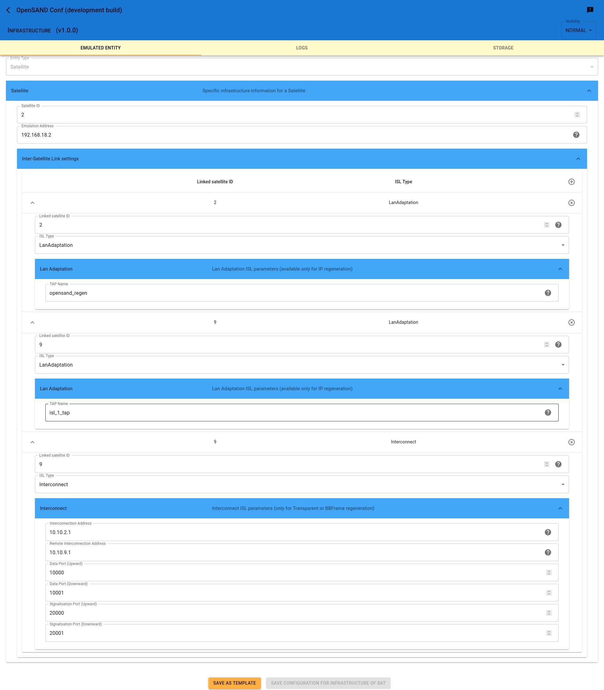

> Note that when using the IP regenerative satellite, you also need to configure a LanAdaptation
associated to the same satellite so the packets are properly deencapsulated and reencapsulated.
The name of the TAP used in this case is irrelevant and may not even exist as no write attempt
should happen.
